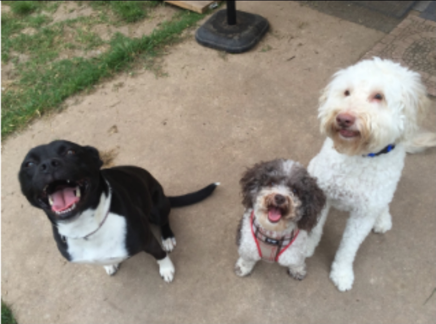
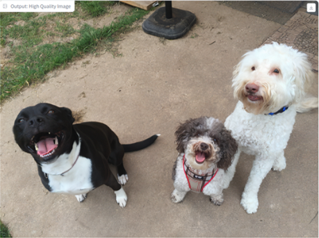
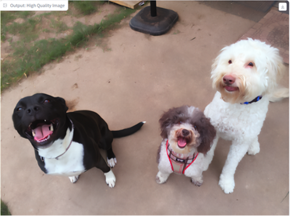
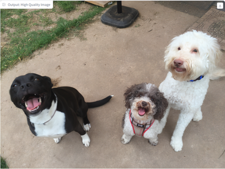

# Reproducing SiNSR: Experiments under Limited and Full GPU Settings

**SinSR: Diffusion-Based Image Super-Resolution in a Single Step**

This repository is based on the official implementation of the paper  ["SinSR: Diffusion-Based Image Super-Resolution in a Single Step"](https://arxiv.org/pdf/2311.14760.pdf).

## Overview
This repository is based on the official implementation of **SiNSR**.
The goal of this project is to reproduce the SinSR model and verify its behavior
under both limited computational resources and the original experimental settings
described in the paper.

## Experimental Setup and Reproduction Strategy
To validate the functionality and behavior of the SinSR model, 
experiments were conducted in two stages.

**Stage 1: Reduced-scale verification**
Due to limited GPU resources, an initial experiment was performed
to confirm the core behavior of the SinSR model.
The training setup was intentionally simplified by reducing the dataset size
to approximately 5,000 images, lowering
the image resolution to 128, setting the batch size to 1, and 20,000 training iterations.
This stage aimed to verify that the model functions as described in the paper
before scaling up to the full experimental setting.

**Stage 2: Full-scale reproduction**
After confirming the model behavior, the experiment was repeated
under conditions matching the original paper.
Using two GPUs, the model was trained with approximately 70,000 training images,
image resolution of 256, batch size of 4, and 500,000 training iterations.
This stage focuses on reproducing the quantitative and qualitative results
reported in the original SinSR paper.

## Results: Stage 1 – Reduced-scale Verification
In the reduced-scale setting, the objective was not to fully reproduce
the quantitative results of the paper, but to verify the core behavior
of the SinSR model under constrained computational resources.
Despite the simplified setup, the model successfully demonstrated
one-step diffusion-based super-resolution behavior as described in the paper.

### Qualitative Results

The following examples show super-resolution results obtained
from the reduced-scale training setting (resolution 128, batch size 1,
approximately 5,000 training images).

| LR Image | SinSR (1-step) | ResShift (1-step) | ResShift (15-step) |
|---------|----------------|-------------------|--------------------|
|  |  |  |  |

**Observations**

From the reduced-scale experiment, we make the following observations:

- The student model (SinSR, 1-step) successfully learns a deterministic one-step
  mapping from the noisy latent to the high-resolution image, producing visually
  plausible results despite the simplified training setup.
- Compared to the 1-step ResShift result, SinSR exhibits improved structural
  consistency and sharper object boundaries.
- While the 15-step ResShift teacher model still achieves the highest visual
  quality, the gap between the student and teacher outputs is reasonably small,
  confirming that the core functionality of SinSR is preserved even under
  limited computational resources.

These results validate that the SiNSR training pipeline is correctly implemented
and behaves as expected before scaling up to the full experimental setting.

---

## Loss Weight Sensitivity Analysis (Stage 1)

In the original SiNSR paper, the training objective is defined as a weighted sum of
three loss terms: inversion loss (L_inverse), distillation loss (L_distill), and
ground-truth consistency loss (L_gt), with the default weight ratio set to 1:1:1.

During the reduced-scale experiment, a significant imbalance in the magnitudes of
the individual loss terms was observed. In particular, the inversion loss tended to
dominate the total loss, causing the optimization process to focus excessively on
minimizing inversion error rather than improving reconstruction fidelity with
respect to the ground truth.

To analyze the impact of loss weighting, additional experiments were conducted using
different loss ratios while keeping all other training conditions fixed.

### Case 1: Original paper setting (Loss ratio = 1 : 1 : 1)

In this setting, the loss weights were configured to follow the original paper,
with equal contributions from the inversion loss, distillation loss, and
ground-truth consistency loss.

<table>
<tr>
<th>Image</th><th>Student</th><th>Teacher</th><th>PSNR ↑</th><th>LPIPS ↓</th><th>CLIP ↑</th><th>MUSIQ ↑</th>
</tr>

<tr>
<td align="center">1</td>
<td align="center"></td>
<td align="center"></td>
<td align="center">22.99</td>
<td align="center">0.488</td>
<td align="center">0.321</td>
<td align="center">48.18</td>
</tr>

<tr>
<td align="center">2</td>
<td align="center"></td>
<td align="center"></td>
<td align="center">24.56</td>
<td align="center">0.553</td>
<td align="center">0.469</td>
<td align="center">60.02</td>
</tr>

<tr>
<td align="center">3</td>
<td align="center"></td>
<td align="center"></td>
<td align="center">21.68</td>
<td align="center">0.534</td>
<td align="center">0.622</td>
<td align="center">57.66</td>
</tr>
</table>

> **Note:**  
> All quantitative metrics (PSNR, LPIPS, CLIP, MUSIQ) are computed **only on the student model outputs**.  

### Case 2: Adjusted loss weighting (Loss ratio = 1 : 1 : 2)

In this setting, the ground-truth consistency loss was assigned a higher weight while keeping the inversion and distillation losses unchanged.

**Motivation**

During the reduced-scale training, the inversion loss exhibited a significantly larger magnitude compared to the ground-truth consistency loss. This imbalance caused the optimization process to focus excessively on minimizing the inversion error, which slowed down effective learning toward ground-truth image reconstruction.

By increasing the weight of the ground-truth consistency loss, the training objective was rebalanced to encourage better reconstruction quality while maintaining stable inversion and distillation behavior.

<table>
<tr>
<th>Image</th><th>Student</th><th>Teacher</th><th>PSNR ↑</th><th>LPIPS ↓</th><th>CLIP ↑</th><th>MUSIQ ↑</th>
</tr>

<tr>
<td align="center">1</td>
<td align="center"></td>
<td align="center"></td>
<td align="center">22.88</td>
<td align="center">0.497</td>
<td align="center">0.357</td>
<td align="center">49.10</td>
</tr>

<tr>
<td align="center">2</td>
<td align="center"></td>
<td align="center"></td>
<td align="center">24.42</td>
<td align="center">0.557</td>
<td align="center">0.687</td>
<td align="center">58.65</td>
</tr>

<tr>
<td align="center">3</td>
<td align="center"></td>
<td align="center"></td>
<td align="center">21.71</td>
<td align="center">0.549</td>
<td align="center">0.611</td>
<td align="center">56.47</td>
</tr>
</table>
